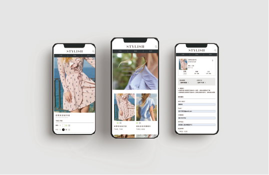
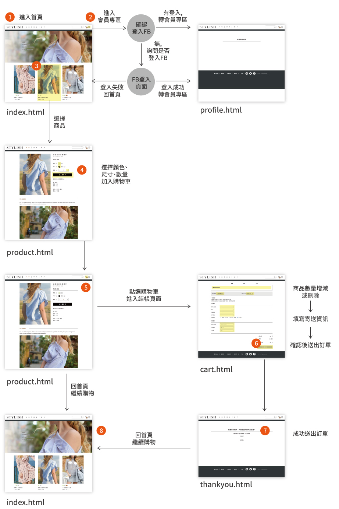
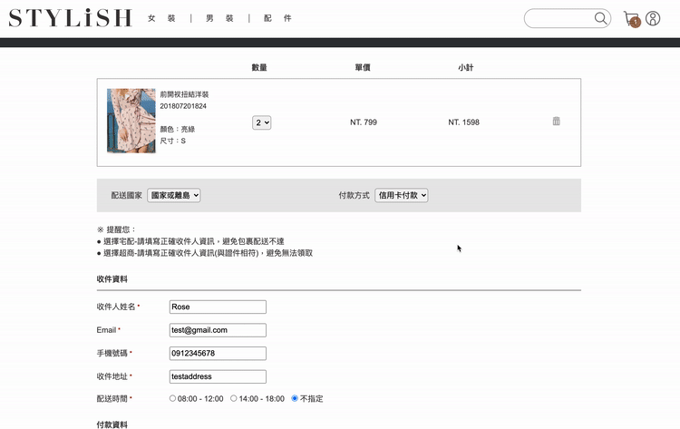

# STYLiSH
A fashion e-commerce website developed with pure JavaScript.

## Demo
Website link: https://stylish-784bb.web.app/

## Technologies
- Front-End Fundamental
    - HTML / CSS 
    - Responsive Web Design (RWD)
    - Pure JavaScript
    - Back-End API
    - Web Storage

- Third party API
    - TapPay (payment service)
    - Facebook SDK (sign in with Facebook credentials)

## Flow Chart

## Features
### Slide show effect 

### Infinte Scroll - Show next page of products automatically as the user scrolls down to the bottom

### Add products to shopping cart

### Checkout with credit cards using TapPay sevice

## Contact
E-mail: b506104062@tmu.edu.tw

